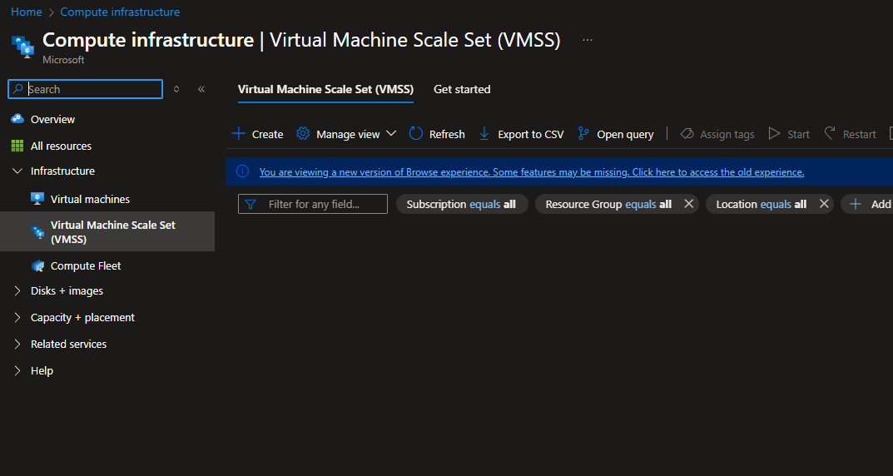

# Here's a walkthrough guide on how to deploy a simple Virtual Network (VNet) using a BICEP file with Visual Studio Code 🚀

## Step 1: Prerequisites
Make sure you have the following prerequisites in place:

- Azure subscription
- Visual Studio Code installed
- Azure CLI installed and logged in

## Step 2: Install BICEP Extension

- Open Visual Studio Code.
- Go to the Extensions view by clicking on the Extensions icon (puzzle piece) in the sidebar.
- Search for "BICEP" and click "Install" on the official "Bicep" extension.

## Step 3: Create a New BICEP File
- In Visual Studio Code, create a new file with a .bicep extension, for example, simple-vnet.bicep.

## Step 4: Write BICEP Code

- Add the following code to your simple-vnet.bicep file to define a simple VNet:

```bicep
resource vnet 'Microsoft.Network/virtualNetworks@2023-06-01' = {
  name 'devvnet'
  location: resourceGroup().location
  properties: {
   addressSpace: {
    addressPrefixes: [
      '10.0.0.0/21'
    ]
   }  
  }
}
``````

This code defines a VNet named 'myVNet' or in my exmaple devvnet.  

## Step 5: Deploy the BICEP Template

- Save your simple-vnet.bicep file.
- Open a terminal in Visual Studio Code.
- Use the Azure CLI to deploy the BICEP template by running the following command:
```
New-AzResourceGroupDeployment -ResourceGroupName devvnet -TemplateFile .\vnet.bicep -Mode Incremental -verbose
```

Replace <resource-group-name> with the name of your Azure resource group where you want to deploy the VNet.

## Step 6: Wait for Deployment

- The deployment process may take a few moments. You'll see progress updates in the terminal.

## Step 7: Verify the Deployment

- Once the deployment is successful, you can verify it by going to the Azure portal or should see a similar message in the terminal:



## Step 8: Clean Up (Optional)

If you want to clean up the resources created, you can run the following command:
bash
Copy code
az group delete --name <resource-group-name> --yes --no-wait
Replace <resource-group-name> with the name of your Azure resource group.

And that's it! You've successfully deployed a simple VNet using a BICEP file in Visual Studio Code. Enjoy your network! 🌐✨